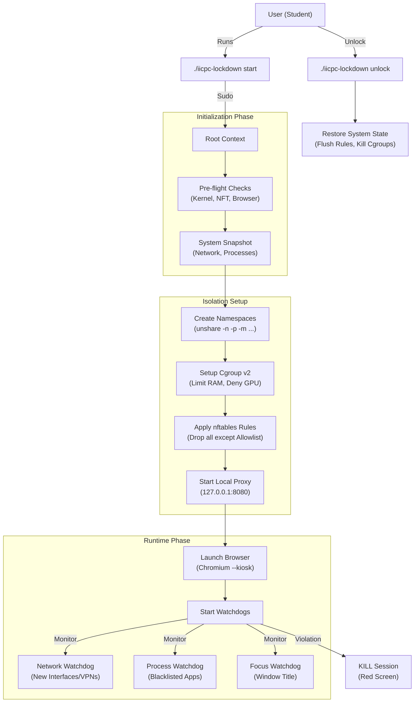

# Design Document: IICPC Lockdown

## Chosen Architecture & Key Insights

The `iicpc-lockdown` tool is built on a philosophy of **defense-in-depth**, utilizing standard Linux kernel features to create a secure, isolated environment without requiring custom kernel modules.

### 1. The Isolation Model
Instead of relying on a single security mechanism, we wrap the contestant's environment in multiple layers of isolation:
*   **Layer 1: Namespaces**: We use `unshare` to create new namespaces for PID, Network, Mount, IPC, UTS, and User. This makes the rest of the system "invisible" to the exam process.
*   **Layer 2: Cgroups v2**: We create a dedicated control group (`/sys/fs/cgroup/iicpc`) to strictly limit resource usage (RAM, PIDs) and, crucially, to deny access to device nodes (like GPUs) to prevent local LLM acceleration.
*   **Layer 3: Network Filtering**: We use `nftables` for kernel-level packet filtering, ensuring only whitelisted traffic leaves the machine.
*   **Layer 4: Application Level**: The browser itself is run in a restricted "kiosk" mode with no extensions or developer tools.

### 2. Rust as the Foundation
We chose **Rust** for this project over C++ or Go for several strategic reasons:
*   **Memory Safety**: Critical when handling `sudo` privileges and system-level calls. Rust prevents entire classes of vulnerabilities (buffer overflows, use-after-free) that could be exploited to bypass the lockdown.
*   **Zero-Cost Abstractions**: We can use high-level libraries for async I/O (`tokio`) and system interfaces (`nix`) without sacrificing the raw performance needed for the watchdog loop.
*   **Single Static Binary**: Rust produces a single, dependency-free binary (mostly) that is easy to distribute and run on various Linux distributions.

### 3. The Hybrid Network Approach
Pure IP filtering is insufficient for modern CDNs (like Cloudflare) where IPs change dynamically. We implemented a hybrid approach:
*   **Kernel (nftables)**: Blocks all non-Codeforces traffic at the packet level.
*   **User-space (Proxy)**: A lightweight, transparent proxy handles specific edge cases (like TLS SNI verification) and provides granular logging of blocked attempts.

## Architecture Diagram

The following diagram illustrates the system's startup flow and runtime architecture:

## Trade-offs

### 1. Rust vs. Go vs. C++
*   **Decision**: Rust.
*   **Trade-off**: **Development Speed vs. Safety/Reliability**.
    *   *Go* would have been faster to write (easier concurrency, simpler syntax) but carries a heavier runtime (GC) and is easier to reverse-engineer/modify.
    *   *C++* offers equal power but requires manual memory management, increasing the risk of segfaults during a live contest.
    *   *Rust* has a steeper learning curve but guarantees a crash-free experience (mostly) and "correctness by design," which is paramount for a proctoring tool.

### 2. X11 vs. Wayland Support
*   **Decision**: Hybrid support with "Soft" lockdown on Wayland.
*   **Trade-off**: **Security vs. Compatibility**.
    *   *X11* allows global input grabbing (`XGrabKeyboard`), making it impossible to Alt+Tab.
    *   *Wayland* is secure by design and prevents global grabbing.
    *   *Compromise*: We support both. On X11, we can enforce stricter controls. On Wayland, we rely on **active monitoring** (Focus Watchdog) to detect window switching rather than preventing it, as preventing it requires compositor-specific protocols that vary between GNOME, KDE, and Hyprland.

### 3. Allowlist vs. Blocklist
*   **Decision**: Strict Allowlist for Network, Blocklist for Processes.
*   **Trade-off**: **Usability vs. Security**.
    *   *Network*: We use an **Allowlist** (Codeforces only). This is inconvenient if the contest requires other resources (e.g., language docs), but it is the only way to prevent access to LLMs/Cheating sites. A blocklist is impossible to maintain against the entire internet.
    *   *Processes*: We use a **Blocklist** (Ollama, Discord, etc.). We cannot use an allowlist here because the user needs *some* system processes to run the OS. We mitigate the risk of "unknown" cheat tools by also blocking categories of tools (compilers, interpreters) and monitoring for new systemd services.

### 4. Kernel Modules vs. User-space
*   **Decision**: User-space + Standard Kernel Features.
*   **Trade-off**: **Power vs. Portability**.
    *   Writing a custom Kernel Module (LKM) would give us absolute control (unbeatable anti-cheat).
    *   However, it would require the user to compile the module against their specific kernel headers (DKMS), which is error-prone and "scary" for students.
    *   We chose to use **standard Linux features** (namespaces, cgroups, nftables) that are present in every modern distro. This ensures the tool "just works" on Ubuntu, Debian, Fedora, etc., without complex installation steps.
