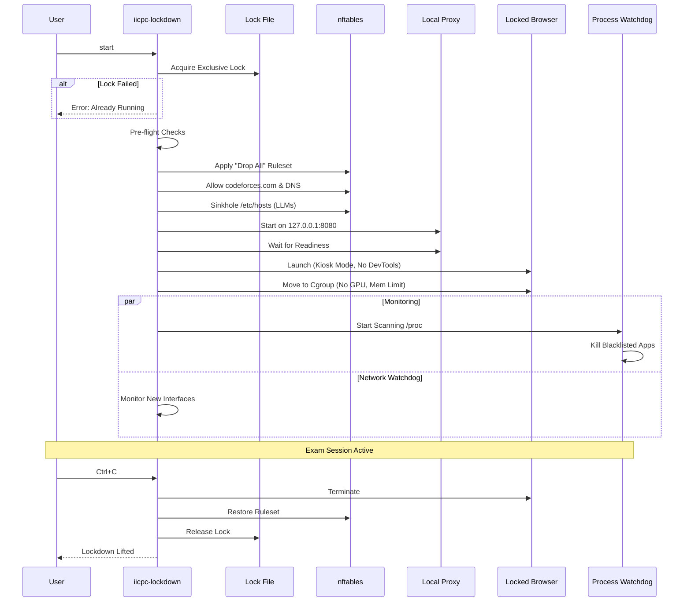

# IICPC Lockdown - Network & Application Blocking System

## Overview and Purpose

**IICPC Lockdown** is a specialized security application designed for the **IICPC Technical Challenge (Track 2)**. Its primary purpose is to create a secure, proctored environment on a Linux machine for competitive programming contests.

When active, the application enforces a strict "lockdown" state:
*   **Network Isolation**: Blocks all outbound network traffic except for **codeforces.com** (including its subdomains and CDNs) using `nftables` and a local transparent proxy.
*   **Application Blocking**: Prevents the launching of any new applications (terminals, editors, other browsers) and actively monitors for forbidden processes (LLMs, remote desktop tools).
*   **Kiosk Mode**: Forces a specific browser (Chromium/Firefox/Brave) into a single-tab, full-screen mode.
*   **Anti-Cheating**: Detects and mitigates common cheating methods such as using local LLMs, VPNs, VMs, or secondary devices.

This project demonstrates system-level programming in Rust, utilizing Linux namespaces, cgroups, seccomp, and nftables to achieve high-security isolation.

## Build Steps

### Prerequisites
*   **OS**: Linux (Ubuntu 22.04/24.04 or Debian 12 recommended).
*   **Kernel**: Version **5.10+** (required for `nftables` TLS SNI support).
*   **Language**: Rust (latest stable toolchain).
*   **Dependencies**:
    *   `nftables` (Version **>= 0.9.8**)
    *   Supported Browser: `chromium-browser`, `google-chrome`, `brave`, `microsoft-edge`, or `firefox`.
    *   Development libraries: `libssl-dev`, `pkg-config`.

## Rust Toolchain Setup

Install and verify the Rust compiler and build tools used to compile the project.

### Install Rust

```bash
curl --proto '=https' --tlsv1.2 -sSf https://sh.rustup.rs | sh
source ~/.cargo/env
```

Verify install:

```bash
rustc --version
cargo --version
```


## Dev Tooling

Install tooling required for efficient development workflows.

### Install cargo-watch

```bash
cargo install cargo-watch
```

`cargo-watch` automatically rebuilds and re-runs the application when files change.

## Development Workflow (Watcher Mode)

Run the project continuously during development with auto-rebuilds on code changes.

```bash
cargo watch -x run
```

## Compile Binary (Debug)

Build a fast, unoptimized binary used primarily for development and local testing.

```bash
cargo build
```

The resulting binary will be located at `target/release/iicpc-lockdown`.

Run:

```bash
sudo ./target/debug/iicpc-lockdown start
```

## Compile Binary (Release)

Build a fully optimized binary intended for real usage and deployment.

```bash
cargo build --release
```


## CLI Detailed Documentation

The `iicpc-lockdown` binary supports several subcommands to manage the lifecycle of the secure session and for debugging purposes.

```
$ iicpc-lockdown
Secure Lockdown Tool for Linux

Usage: iicpc-lockdown <COMMAND>

Commands:
  init                Creates necessary directories, performs preflight checks, and captures process baseline
  start               Starts the lockdown daemon
  status              Checks if the lockdown is currently active by verifying the lock file
  unlock              Releases the lockdown, restoring normal system operation
  keep-alive          A background heartbeat process that prevents the system from sleeping
  scan                Performs a one-time forensic scan for blacklisted processes (see help for options)
  browser-test        Launches the locked browser instance in isolation to verify kiosk mode settings and user profile creation
  proxy-test          Runs the internal proxy server for testing network filtering logic independently
  restrict-apps-test  Runs the process watchdog in isolation to test blacklist enforcement
  focus-monitor       Runs the focus monitoring loop to test window title detection
  audio-test          Tests the audio subsystem lockdown (mute sink/source)
  help                Print this message or the help of the given subcommand(s)

Options:
  -h, --help     Print help
  -V, --version  Print version

```

### Core Commands

#### `init`
Initializes the system for the lockdown tool. This command is the "setup" phase and **must be run as root**.

**How it works:**
1.  **Pre-flight Checks**:
    *   **Kernel Version**: Verifies that the Linux kernel is **5.10 or newer**. This is strictly required because the tool relies on modern `nftables` features (like TLS SNI matching) that are not present in older kernels.
    *   **nftables Support**: Checks that the installed `nftables` binary is version **0.9.8 or newer**.
2.  **Directory Creation**:
    *   Creates the log directory: `/var/log/iicpc-lockdown/`.
    *   Creates the runtime directory: `/run/iicpc-lockdown/` (used for lock files and PID tracking).
3.  **Baseline Capture**:
    *   Captures a snapshot of currently running processes.
    *   This baseline is used to distinguish between legitimate user processes (like the desktop environment) and potential cheating tools that might be launched later.
    *   The baseline is saved to a file for use during the lockdown session.

**Usage**:
```bash
sudo ./iicpc-lockdown init
```

#### `start`
Activates the full lockdown mode. This is the main entry point for the exam session.

**How it works (The Lockdown Sequence):**

The `start` command orchestrates a complex sequence of security measures to lock down the machine.



1.  **Lock Acquisition**: Acquires a file lock (`/run/iicpc-lockdown/active.lock`) to ensure only one instance runs.
2.  **Baseline Snapshot**: Records the current system state (network interfaces, running processes) to detect changes later.
3.  **Network Lockdown**:
    *   **nftables**: Backs up the current ruleset, then applies a strict "Drop All" policy.
    *   **Allowlist**: Explicitly allows traffic to **codeforces.com** (and its subdomains/CDNs) and DNS (port 53).
    *   **Hosts File**: Modifies `/etc/hosts` to sinkhole known LLM sites (ChatGPT, Claude, etc.) to `0.0.0.0` as a secondary defense layer.
4.  **Proxy Startup**: Starts a local transparent proxy on `127.0.0.1:8080` to handle TLS SNI verification for allowed domains.
5.  **Browser Launch**:
    *   **Detection**: Finds an installed browser (Chromium, Brave, Firefox).
    *   **User Resolution**: Identifies the real user (via `SUDO_USER`) to run the browser as a non-root user for security.
    *   **Ephemeral Profile**: Creates a temporary, clean user profile in `/tmp/chrome-home-{uid}` to ensure no extensions or history are present.
    *   **Kiosk Mode**: Launches the browser with `--kiosk`, `--no-first-run`, and `--disable-dev-tools`.
6.  **Cgroup Isolation**:
    *   Creates a cgroup v2 at `/sys/fs/cgroup/iicpc`.
    *   Moves the browser process into this group.
    *   **Resource Limits**: Sets memory limits and **denies access to GPU devices** (`/dev/dri`) to prevent local LLM acceleration.
7.  **Watchdog Activation**: Starts background threads to monitor for:
    *   **Forbidden Processes**: Scans `/proc` for blacklisted apps (Ollama, Discord, etc.).
    *   **Network Changes**: Detects new interfaces (VPNs, Hotspots).

**Usage**:
```bash
sudo ./iicpc-lockdown start
```

#### `status`
Checks and displays the current status of the application.

**How it works:**
*   **Lock Check**: Attempts to acquire an **exclusive** lock on `/run/iicpc-lockdown/active.lock`. If the file is already exclusively locked by the `start` daemon, the acquisition fails, confirming that "Lockdown is currently active."
*   **Output**: Simple text status ("Locked" or "Unlocked").

**Usage**:
```bash
./iicpc-lockdown status
```

#### `unlock`
Performs an emergency exit and restores the system to its pre-lockdown state.

**How it works (The Restoration Sequence):**
1.  **Lock Acquisition**: Acquires the lock to ensure it has authority to modify the system state.
2.  **Cgroup Cleanup**: Removes the `/sys/fs/cgroup/iicpc` group, ensuring all contained processes (browser, watchdogs) are killed by the kernel if they haven't exited.
3.  **Service Restoration**: Unmask and restarts any systemd services that were automatically blocked by the watchdog (e.g., if a student tried to start a VPN service).
4.  **Hosts Restoration**: Restores the original `/etc/hosts` file from the backup created at start.
5.  **Firewall Cleanup**: Deletes the `iicpc_lock` table from `nftables`, effectively removing all network restrictions.
6.  **Audio Restoration**: Unmutes the audio sink and source (microphone) to restore normal audio function.
7.  **Connectivity Verification**: Performs a final check to ensure `google.com` is reachable again, confirming the system is back to normal.

**Usage**:
```bash
./iicpc-lockdown unlock
```

### Diagnostic & Testing Commands

#### `scan`
Performs a one-time forensic scan for blacklisted processes without starting the full lockdown. Useful for pre-contest checks.

**How it works:**
1.  **Process Iteration**: Walks through `/proc` to inspect every running process.
2.  **Signature Matching**: Compares process names and command lines against a built-in blocklist of over 100 known cheating tools (LLMs, VNC, remote desktop, compilers).
3.  **Reporting**: Generates a detailed JSON report in `/tmp/IICPC_SCAN_REPORT_<timestamp>.json` containing all findings.
4.  **Active Countermeasures** (with `--kill`):
    *   Kills the offending process tree.
    *   **Service Masking**: If the process belongs to a systemd service (e.g., `ollama.service`), it automatically *masks* that service to prevent it from restarting.

**Usage**:
```bash
sudo ./iicpc-lockdown scan --kill
```

#### `keep-alive`
A background process that holds the global lock.

**How it works:**
*   Acquires the `/run/iicpc-lockdown/active.lock` file lock and enters an infinite sleep loop.
*   **Purpose**: This prevents any other instance of `iicpc-lockdown` (including `start`) from running. It can be used to "reserve" the machine state or debug lock contention logic.

**Usage**:
```bash
./iicpc-lockdown keep-alive
```

#### `browser-test`
Launches the locked browser instance in isolation to verify kiosk mode settings and user profile creation.

**How it works:**
*   Executes the exact same browser launch logic as `start` (resolving the user, creating the ephemeral `/tmp` profile, applying flags) but **skips** the network lockdown and cgroup isolation.
*   **Purpose**: Verifies that the browser can launch correctly on the system and that the kiosk flags are working as expected.

**Usage**:
```bash
sudo ./iicpc-lockdown browser-test
```

#### `proxy-test`
Runs the internal proxy server for testing network filtering logic independently.

**How it works:**
*   Starts the async HTTP CONNECT proxy on `127.0.0.1:8080`.
*   **Purpose**: Allows manual verification of the allowlist using tools like `curl`.
    *   Test Allow: `curl -v -x http://127.0.0.1:8080 https://codeforces.com` (Should work)
    *   Test Block: `curl -v -x http://127.0.0.1:8080 https://google.com` (Should return 403 Forbidden)

**Usage**:
```bash
./iicpc-lockdown proxy-test
```

#### `focus-monitor`
Runs the focus monitoring loop to test window title detection on X11/Wayland.

**How it works:**
*   Continuously polls the active window title every second.
*   **Backends**: Attempts to use multiple methods to find the active window, in this order:
    1.  `wmctrl` (X11 / XWayland)
    2.  `xdotool` (X11)
    3.  GNOME Shell DBus (Wayland)
    4.  KDE KWin DBus (Wayland)
    5.  Hyprland IPC (Wayland)
    6.  Sway IPC (Wayland)
*   **Purpose**: Debugging tool to ensure the anti-tab-switching mechanism works on the specific Desktop Environment being used.

**Usage**:
```bash
./iicpc-lockdown focus-monitor
```

#### `restrict-apps-test`
Runs the process watchdog in isolation to test blacklist enforcement.

**How it works:**
*   Starts the `watchdog` module in a loop.
*   **Monitoring**: Continuously scans `/proc` for blacklisted processes (e.g., `code`, `python`, `discord`).
*   **Enforcement**: If a blacklisted process is found, it is immediately killed.
*   **Purpose**: Verifies that the blacklist logic is correctly identifying and terminating forbidden applications without needing to start the full lockdown.

**Usage**:
```bash
sudo ./iicpc-lockdown restrict-apps-test
```

#### `audio-test`
Tests the audio subsystem lockdown.

**How it works:**
*   **Muting**: Attempts to mute both the default audio sink (output) and source (microphone).
*   **Backends**:
    *   `wpctl` (WirePlumber/PipeWire): Preferred modern backend.
    *   `amixer` (ALSA): Fallback for older systems.
*   **Loop**: Continuously enforces the mute state every second to prevent users from unmuting.
*   **Restoration**: On exit (Ctrl+C), it restores the previous volume state.
*   **Purpose**: Verifies that the tool can successfully silence the machine to prevent communication via audio.

**Usage**:
```bash
./iicpc-lockdown audio-test
```

## Project Structure: What Does What

The source code is organized into modular components, each handling a specific aspect of the lockdown system:

*   **`src/main.rs`**: The entry point. Parses CLI arguments using `clap` and dispatches commands. Enforces root privileges for sensitive operations.
*   **`src/lockdown.rs`**: Orchestrates the lockdown sequence. It manages the global lock file to prevent multiple instances and handles panic hooks for emergency restoration.
*   **`src/firewall.rs`**: The network security core.
    *   Backs up and restores `nftables` rulesets.
    *   Applies a strict whitelist allowing only Codeforces domains (and essential CDNs/assets).
    *   Modifies `/etc/hosts` to sinkhole known LLM and AI sites (ChatGPT, Claude, etc.).
    *   Verifies connectivity to Google (should fail) and Codeforces (should pass).
*   **`src/browser.rs`**: Manages the exam browser.
    *   Detects installed browsers (Chrome, Brave, Firefox, Edge).
    *   Resolves the real desktop user (via `SUDO_USER` or UID 1000) to run the browser as a non-root user.
    *   Creates ephemeral user profiles in `/tmp` to ensure a clean slate (no history/extensions).
    *   Launches with flags for kiosk mode, no devtools, and proxy configuration.
*   **`src/watchdog.rs`**: The active monitoring system.
    *   **Process Watchdog**: Scans `/proc` for blacklisted binaries (LLMs, remote desktop tools, compilers, other browsers). Can kill offending process trees.
    *   **Service Watchdog**: Detects and masks systemd services that shouldn't be running.
    *   **Network Watchdog**: Monitors for new network interfaces (VPNs, hotspots).
    *   Generates forensic reports in JSON format.
*   **`src/focus.rs`**: Anti-tab-switching mechanism.
    *   Monitors the active window title.
    *   Supports X11 (via `xdotool`) and Wayland (via GNOME `busctl` or KDE `qdbus`).
    *   Triggers a "CHEATING DETECTED" red screen if focus is lost.
*   **`src/proxy.rs`**: A lightweight async TCP proxy.
    *   Intercepts HTTP CONNECT requests.
    *   Validates hostnames against an allowlist (Codeforces + CDNs).
    *   Used to handle HTTPS traffic filtering where pure IP filtering might be insufficient due to CDN IP sharing.
*   **`src/init.rs`**: System initialization.
    *   Verifies Kernel version (>= 5.10) and `nftables` version (>= 0.9.8).
    *   Creates runtime and log directories.
*   **`src/logger.rs`**: Thread-safe logging infrastructure. Writes colored logs to stdout and rotates daily log files in `~/.iicpc-lockdown/logs/` or `/var/log/`.
*   **`src/lock.rs`**: Manages the singleton instance lock (`/run/iicpc-lockdown/init.lock`) using `flock` to ensure only one lockdown session runs at a time.

## Security Model Summary

The security architecture relies on a "Defense in Depth" strategy, assuming that any single layer might be bypassed.

| Layer | Mechanism | Purpose |
| :--- | :--- | :--- |
| **Network** | `nftables` (Kernel) | **Default Deny** policy. Only `codeforces.com` and DNS are allowed at the packet level. |
| **Application** | `cgroup v2` | Limits resources and **denies GPU access** to prevent local LLM acceleration. |
| **Process** | `watchdog` (User-space) | Scans for and kills blacklisted processes (LLMs, Remote Desktop, Compilers). |
| **Isolation** | `unshare` (Namespaces) | Hides the rest of the system from the browser process. |
| **Identity** | Ephemeral Users | Browser runs as a temporary user with a fresh profile (no history/extensions). |

